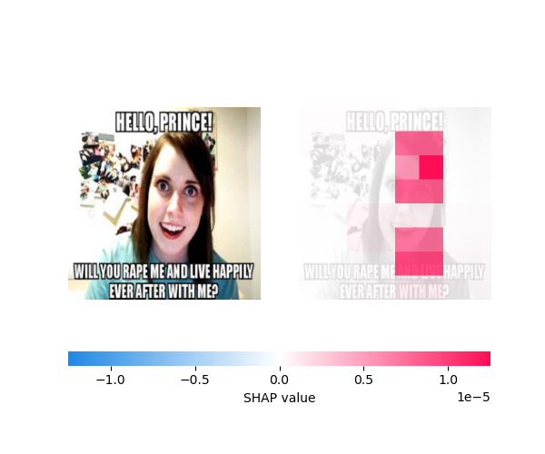
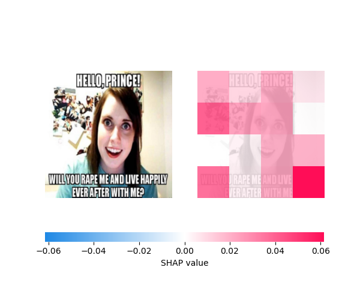
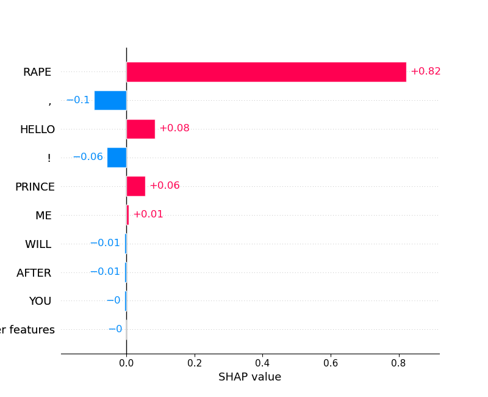
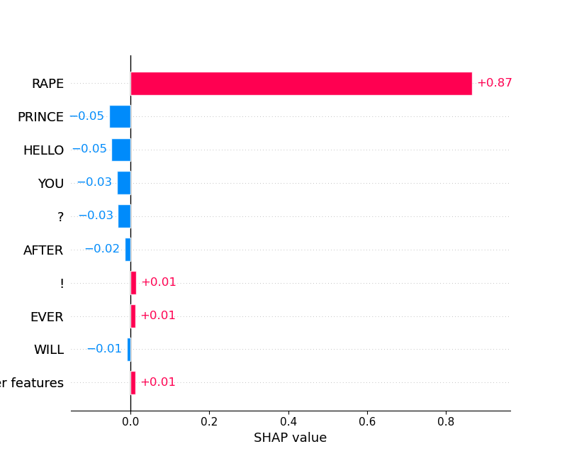

# MultiModalXAI
Project for the Explanaible and Trustworthy AI course @ Polito 2023/2024:

# Disentangled Multi modal Shap Based Explanations for Vision Language Classifiers


|  <br> <h3 style="text-align:center;">Single modality interaction image</h3> |  <br> <h3 style="text-align:center;">Multi modality interaction image</h3> |
|-------------------------------------------|-------------------------------------------|
|  <br> <h3 style="text-align:center;">Single modality interaction text</h3> |  <br> <h3 style="text-align:center;">Multi modality interaction text</h3> |

## Explanation method

Our explanation method aims to explain the contribution of features from different modalities regarding vision-language classification models.<br>

We exploit a perturbation-based feature attribution method like SHAP for computing the attributes for the single modalities and the interaction of the two. This mechanism is inspired to DIME, which consider both single and multi modality interaction for explaining a image-text data sample , and tries to adapt indeed SHAP to the multimodal settings.<br>

# How does it work

# DBSME
Class needed for computing both the single/multi interaction  between input modalities. It accept as parameters:
- <u>**model**</u>: model to explain (Vision Language binary classifier);
- <u>**txt_toknizer**</u>: tokenizer needed for dividing the input text into tokens to mask (needed for the mask explainer);
- <u>**img_shape**</u>: shape of the image to use (needed for the image masker in SHAP) -> the input image will be resized to this shape;
- <u>**token_for_text_masking**</u>: string token to use for masking words in the SHAP single modality for text;
- <u>**disentagled_modalities_explainer**</u>: explainer for the single modality (SingleModAnalyzer class)
- <u>**multimodal_interaction_explainer**</u>: MMSHAP implementation (MMSHAP class);

# SingleAnalyzer
Class needed for computing the **SHAP values of the single modalities** involved in the prediction (image and text). 
In order to compute them a wrapper class for the model is used, which automatically masks one of the madality with default values;
A SHAP Explainer instance is used for copmuting the SHAP values


# MMSHAP
Class needed for computing the **interaction among different modalities**. It is based on a SHAP Explainer and takes as input both modalities by means of a list of strings. This list contains the text tokens (based on the tokenizer used) and a variable number of empty strings, which represent patches of the input image. 

We do this precomputation in order to feed our explainer an homogeneus input that the SHAP library could handle (Otherwise we could not explain inputs of different formats all at ones). 
This representation is fed to a custom masker which masks patch/es of the images and text based on the binary mask generated by the masker, and therefore generates the actual input for both masked image and text respectively, that will be fed to the classifier to explain.

Other than the misogyny classifier, **It can be adapted to any vision-languange binary classifier** by modifying the function that generates the prediction and its inputs (it is supposed a list of images and texts as input to the model...) for both the single and the multi modality

# Misogyny classifier
The baseline for our experiments has been a multi layer perceptron (Hyperparameters used for obtaining the trained model in this repo can be found in the trainer file) which take as input the concatenation of the embeddings of both image and text obtained through a pretraine dversion of CLIP. The training time for a single epoch takes about ~3/4 mins.
The actual model is trained on 10 epochs with:
- **Average Train Loss**:  0.8361
- **Average Test Loss**:  1.6225 
- **Average Accuracy Train**:  79.6520%
- **Average Accuracy Test**:  58.2031%

# Misogyny Dataset
The MAMI Dataset have been retrieved  at the following link https://github.com/TIBHannover/multimodal-misogyny-detection-mami-2022/tree/main/data for the labels and here ## MISSING LINK ##for the data 

# Setup Instructions
To set up the the environment for this project, follow these steps:

```
python -m venv mm_xai_env
mm_xai_env\Scripts\activate # activate the environment (this is the Windows version)
pip install -r requirements.txt
```

# Demo 
In order to reproduce the results showed at the beginning of the README file, produced from the trained Misogyny classifier, type the following code with no arguments:

```
python ./main.py
```

If instead you'd like to test your own meme (always with our Misogyny classifier), type the following code:

```
python ./main.py "path_to_image_meme" "text_meme"
```

The result will show the various plots for the single modalities explanation and for the multi modal one.

# Contributions/Reference
<u>**A Unified Approach to Interpreting Model Predictions**</u>
Scott M. Lundberg, Su-In Lee. In Advances in Neural Information Processing Systems 30, edited by I. Guyon, U. V. Luxburg, S. Bengio, H. Wallach, R. Fergus, S. Vishwanathan, and R. Garnett, pages 4765-4774. Curran Associates, Inc., 2017. Link.

<u>**MM-SHAP: A Performance-agnostic Metric for Measuring Multimodal Contributions in Vision and Language Models & Tasks**</u>
Letitia Parcalabescu, Anette Frank. In Proceedings of the 61st Annual Meeting of the Association for Computational Linguistics (Volume 1: Long Papers), pages 4032-4059. Association for Computational Linguistics, 2023. Link, DOI.

<u>**DIME: Fine-grained Interpretations of Multimodal Models via Disentangled Local Explanations**</u>
Yiwei Lyu, Paul Pu Liang, Zihao Deng, Ruslan Salakhutdinov, Louis-Philippe Morency.